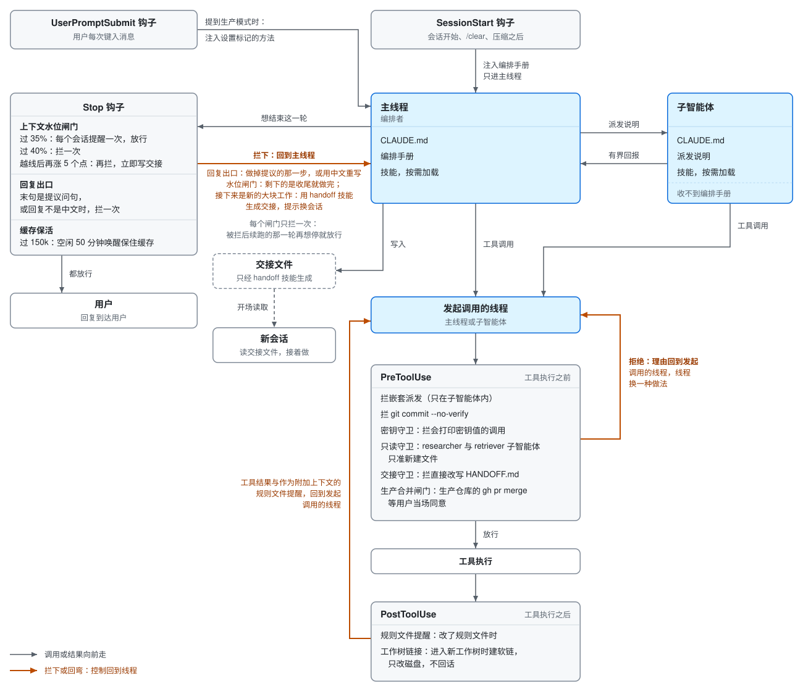

# orchestrator-harness

[](https://github.com/yales66/orchestrator-harness/actions/workflows/ci.yml)

我每一次编码会话都运行在其中的一套 Claude Code 钩子、技能与编排规则。

这套框架分成两份可以各自独立安装的完整副本：英文版在 `en/`，中文版在 `zh/`，中文是我与 Claude 协作时使用的语言。两份的规则相同，译文尽可能贴近原意。两份里的钩子脚本完全一样，脚本内的注释与提示信息是中文，Claude 都能读懂。本说明文件的英文版是仓库根目录的 `README.md`。

## 设计目标

这套框架为长程的智能体编程而建，目标是尽可能少的人工介入。

1. **子智能体上下文精简。** 编排规则只通过 SessionStart 钩子送达主线程；每个子智能体都会加载的 `CLAUDE.md` 只放每个会话都需要的规则。每次委派都是一份目标驱动的派发说明：带可验证验收标准的目标、文件范围、已知上下文、约束、一条自检命令，以及有界的返回格式。子智能体从结论起步，不必重新摸索，也不能再派出自己的子智能体。
2. **长程会话。** 主线程保留决策与结论，把探索、审查与实现委派出去，让上下文预算撑得更久。在上下文窗口填满之前，上下文水位闸门会让会话写出一份交接文件并提示用户换新会话，新会话从这份交接文件接续。
3. **人只在决策点介入。** 编排手册的设计是只把答案属于用户的问题交给用户。交易、动用资金、删数据这类收不回的动作，可逆的准备照做，只在收不回的那一步之前请用户确认。方向有分叉时，只有各分支做出的东西实质不同、且取舍取决于只有用户知道的偏好或约束，才去问用户；否则按推荐分支做，并在开头一句话说明选了哪支。收尾时的下一步只要在用户当前目标之内、做错了可逆、不对外也不调用付费服务，就直接做完再汇报。用户给出的持续授权只覆盖授权时所指的对象与改动，在本会话内有效，用户改口即撤销。确实要请用户拍板时，每个待定项都写清背景、各选项的后果与推荐。回复以提议下一步的问句收尾时，Stop 钩子 `reply-gate` 拦停一次，并把上述判据写进拦截理由。改动影响用户看得见的产物时，交付前先截图对照受影响的状态，并给出能直接打开的预览链接或一行启动命令；面向他人的文稿交付前，先交给一个不带本轮语境的复核子智能体通读。

## 架构

每个线程框里列出该线程收到的内容。高亮的编排手册只经 SessionStart 钩子进入主线程，子智能体收到的是 `CLAUDE.md` 和它拿到的派发说明。两条线程的每次工具调用都经过工具调用钩子；主线程停止时，Stop 钩子之一的上下文水位闸门要求写出交接文件。Stop 钩子里还有回复出口，回复以提议下一步的问句收尾或不是中文时拦停一次；工具调用钩子里还有密钥守卫，以及让 researcher 子智能体只能新建文件的只读守卫。

<picture>
  <source media="(prefers-color-scheme: dark)" srcset="../docs/architecture.zh.dark.svg">
  <source media="(prefers-color-scheme: light)" srcset="../docs/architecture.zh.light.svg">
  
</picture>

## 测量了什么

下面每项结果都来自确定性的测量，在仓库根目录用本仓库里的命令就能复跑。[docs/zh/evaluation.md](../docs/zh/evaluation.md) 说明每项测量的方法与局限，并把三项要花钱调用模型的实验写成设计，跑完之前不报结果。

| 测量 | 结果 | 复跑 |
|---|---|---|
| 钩子回归测试 | 每个副本 486 个用例全部通过 | `for t in en/hooks/tests/*.test.sh; do bash "$t"; done` |
| 钩子变异测试，[eval/hook-mutations](../eval/hook-mutations/README.md) | 往钩子里植入的 54 个缺陷，测试首轮抓住 42 个，为存活的缺陷补上边界用例后抓住 54 个；另有 35 个只照钩子头注释、不看测试写出的留出集缺陷，测试抓住 30 个，这是无偏估计 | `HM_MANIFEST=eval/hook-mutations/holdout.tsv HM_OUT=eval/hook-mutations/holdout-results.md bash eval/hook-mutations/run.sh` |
| 静态上下文，[eval/static-context](../eval/static-context/README.md) | 编排手册经钩子注入时，每个子智能体的首次请求输入是 10,190 词元，写进 `CLAUDE.md` 时是 13,513 词元 | `bash eval/static-context/run.sh` |
| 回复出口回放，[eval/reply-gate-replay](../eval/reply-gate-replay/README.md) | 在回复出口上线前写成的 2,734 条收尾回复上，它的收尾提议规则精确率 68.5%，召回率 31.7% | `python3 eval/reply-gate-replay/score.py --data "$DATA"`，其中 `DATA` 是存放会话记录与标注的私有目录 |

静态测量比较两组隔离配置：H 组安装本框架，N 组同样安装本框架，但把编排手册写进 `CLAUDE.md`，不经 SessionStart 钩子注入。首次请求输入指线程第一次 API 请求的输入词元，只含固定内容，即 Claude Code 自带的系统提示词与工具定义、CLAUDE.md、技能清单、钩子注入的文本，子智能体还包括它收到的派发说明；线程之后读文件、调工具产生的内容都不算。

| 组 | 主线程首次请求输入（词元） | 子智能体首次请求输入（词元） |
|---|---|---|
| H | 20,341 | 10,190 |
| N | 20,330 | 13,513 |

把编排手册留在 `CLAUDE.md` 之外，每个子智能体的首次请求输入就从 N 组的 13,513 词元降到 H 组的 10,190 词元，减少 3,323 词元，约 25%；主线程两组都收到编排手册，首次请求输入只差 11 词元。每组两次重复的总数都相同。中文配置 `zh/` 另测了一次（`SC_COPY=zh`）：子智能体首次请求输入从 13,641 词元降到 10,108 词元，减少 3,533 词元，约 26%。那次 H 组第一次运行时 Claude Code 多下发了 6 个延迟加载的工具，子智能体为 11,371 词元，与其余三次的工具集不同，所以取第二次；逐次数字见 [results.zh.md](../eval/static-context/results.zh.md)。编排手册控制在 10,000 个字符以内，因为 Claude Code 对更长的 SessionStart 注入只给模型 2KB 预览；任一版本超过这个长度，`scripts/check-parity.sh` 就会失败，结果里的加载核对也确认两组主线程都收到了完整的编排手册。测量安装的是英文配置 `en/`，所用的 Claude Code 版本为 2.1.285，主线程与子智能体都用 claude-opus-5-5。Claude Code 自带的系统提示词与工具定义随版本变化，所以这些绝对数值只对 2.1.285 成立，换版本需用该脚本重测。逐次数字、加载核对与局限见 [eval/static-context/results.md](../eval/static-context/results.md)。

[docs/zh/evaluation.md](../docs/zh/evaluation.md) 的「[为什么会话日志前后对比不能当证据](../docs/zh/evaluation.md#为什么会话日志前后对比不能当证据)」一节说明我自己的会话日志为何说明不了本框架是否有益，同一文档还说明完整的受控实验需要什么。

## 目录结构

两个语言文件夹的结构相同，都与 `~/.claude/` 一致：

| 路径 | 是什么 |
|---|---|
| `CLAUDE.md` | 加载进每个会话的全局规则：怎样写文稿、怎样改现有代码、怎样测试 |
| `orchestrator-playbook.md` | 主线程作为编排者的规则：委派什么、怎样写子智能体派发说明、怎样交接长任务、交付闸门、git 约定 |
| `hooks/` | 在 `settings.json` 中注册的钩子，均为 `.sh` 脚本；每个钩子都从标准输入读取钩子 JSON |
| `hooks/tests/` | 覆盖全部九个钩子的回归测试 |
| `agents/` | `researcher` 子智能体的定义，用于只读的调研、审查与诊断，可以新建报告文件，不改已有文件 |
| `skills/` | 为本框架编写的技能，由 Claude Code 按需加载 |
| `settings.example.json` | 注册全部钩子的 `hooks` 配置块，路径位于 `$HOME/.claude` 之下 |

## 钩子

| 钩子 | 事件 | 行为 | 测试 |
|---|---|---|---|
| `orchestrator-playbook-session-start.sh` | SessionStart | 把 `orchestrator-playbook.md` 注入主线程。编排手册放在这里而不放进 `CLAUDE.md`，是因为 `CLAUDE.md` 也会加载进每个子智能体，而编排规则只供主线程使用 | `orchestrator-playbook-session-start.test.sh` |
| `block-nested-subagent.sh` | PreToolUse，匹配 `Agent\|Task\|Workflow` | 拒绝子智能体再派出子智能体或工作流。它以 `agent_id` 为判据，该字段只在子智能体内部存在，因此用 `--agent` 启动的会话不会被拦 | `block-nested-subagent.test.sh` |
| `block-no-verify-commit.sh` | PreToolUse，匹配 `Bash` | 拒绝 `git commit --no-verify` 与 `git commit -n`，确保 `commit-msg` 钩子总会运行。它对命令做分词，只检查 `commit` 子命令的选项，因此 `[ -n "$C" ]` 或提交信息里的 `-n` 都会放行 | `block-no-verify-commit.test.sh` |
| `context-watermark-gate.sh` | Stop | 上下文水位闸门，见下文 | `context-watermark-gate.test.sh` |
| `rule-file-edit-check.sh` | PostToolUse，匹配 `Edit\|Write` | 当被编辑的路径是大语言模型规则文件时，注入一条提醒，要求遵循 `rule-file-editing` 技能。触发是确定性的，不依赖技能自动加载 | `rule-file-edit-check.test.sh` |
| `worktree-symlink-claudemd.sh` | PostToolUse，匹配 `EnterWorktree` | 把主检出目录中的 `CLAUDE.md`、`node_modules` 与 `.env*` 以符号链接接入新建的 git 工作树，不覆盖已有的真实文件 | `worktree-symlink-claudemd.test.sh` |
| `reply-gate.sh` | Stop | 回复的末句是「要我…吗」「Shall I …?」这类提议下一步的问句时拦停一次，拦截理由重申何时直接做、何时以及怎样请用户拍板。设置 `REPLY_LANG=zh` 时（`zh/` 的配置已设置），超过 150 个字符的回复里中日韩字符不到中日韩字符与拉丁字母总数的五分之一，也拦停一次。两项检查都先剥掉围栏代码块、行内代码与 URL；`stop_hook_active` 为真时放行，因此不会循环拦截 | `reply-gate.test.sh` |
| `secret-guard.sh` | PreToolUse，匹配 `Bash\|Read` | 拒绝会把密钥值打印进模型上下文的调用。Read 的目标文件名是 `.env` 或 `.env.*` 就拒绝，文件名按小写比较，`.example`、`.sample` 与 `.template` 样例放行。shell 命令按 `&&`、`\|\|`、`;`、`\|` 与换行拆成子命令逐段判断，命令替换也拆出来，交给 `bash -c`、`sh -c`、`zsh -c` 或 `eval` 的命令串同样逐段判断，最多嵌套三层。以下情形拒绝：用 `cat`、`head`、`tail`、`less`、`awk`、非就地的 `sed`、`sort`、`diff`、`base64`、`xxd` 这类打印文件内容的命令读 `.env`；用 `grep` 或 `rg` 读 `.env` 却不带只报计数、只报是否命中或只报文件名的选项；递归的 `grep`，或会搜点文件的 `rg`，搜索的目录树里有 `.env`，且没有被它的包含、排除或通配选项排掉；用 `echo` 或 `printf` 展开名称含 KEY、SECRET、TOKEN、PASSWORD、PASSWD 或 CREDENTIAL 的变量，其中 `${#VAR}` 只给长度，放行；不带参数或参数名含上述片段的 `printenv`；单独使用的 `env`、`export -p` 或 `set`。相对的搜索根跟随同一条命令里前面的 `cd` 或 `pushd`，`cd` 的目标不是字面量时按含 `.env` 算。遍历目录树时跳过 `.git` 与 `node_modules`，超过 20,000 项就放行。只用到值而不打印值的命令放行，例如 `source .env` 后接命令，拒绝理由里也给出这类替代写法 | `secret-guard.test.sh` |
| `subagent-readonly-guard.sh` | PreToolUse，匹配 `Edit\|Write\|NotebookEdit\|MultiEdit\|Bash` | 在 `researcher` 子智能体内部放行新建文件，拒绝改动已有文件。所有 Edit、MultiEdit 与 NotebookEdit 都拒绝，Write 只在目标已存在时拒绝。shell 命令的拆分与展开方式和密钥守卫相同，以下情形拒绝：`sed -i` 或 `perl -i`；重定向或 `tee` 写到已存在的文件（`/dev/null` 与新路径放行）；`rm`、`mv`、`truncate`、`chmod` 或 `ln -f`；`cp` 的目标已存在；改动工作区、暂存区、引用或远端的 git 子命令，以及 `git branch -d` 或 `-D`；内联解释器代码里有写入、改名或删除文件的调用，不论目标是否已存在。内联代码指 `python -c`、`node -e` 或 `-p`、`perl -e` 与 `ruby -e` 的参数，`<<<` 后的字符串，以及以 `<<` 内嵌文档形式喂给这几个解释器的正文；执行脚本文件的调用，例如 `python3 script.py`，看不到代码，不在判断范围内。相对路径跟随同一条命令里前面的 `cd` 或 `pushd`，`cd` 的目标不是字面量时，之后的相对写入目标一律按已存在算。它同时以 `agent_id` 与 `agent_type` 为判据，因此用 `--agent researcher` 启动的会话不受限制 | `subagent-readonly-guard.test.sh` |

## 技能

| 技能 | 用途 |
|---|---|
| `rule-file-editing` | 编辑 `CLAUDE.md`、`SKILL.md` 等指令文件时的纪律：按改动如何改变运行时行为来裁决每处改动，把例外写成分支，并把删除以及新建的规则文件交给独立复核者 |
| `memory-audit` | 裁定哪些 Claude Code 记忆条目保留、合并或删除，并重建索引 |

## 两个值得细看的机制

**规则文件改动的独立复核。** `rule-file-editing` 技能在每次删除或重构一条规则、以及每次新建规则文件之后，都以派出一个只读复核子智能体收尾，这个子智能体不带任何对话历史。复核者只拿到改动前后的差异（或新文件全文）并回传裁决，因此它会像一个毫无上下文的未来会话那样去读这次改动。

**上下文水位闸门。** `Stop` 钩子的输入不含词元字段，所以 `context-watermark-gate.sh` 从会话记录中读取真实用量：最后一条助手消息的 `input_tokens + cache_read_input_tokens + cache_creation_input_tokens`。用量达到上下文窗口的 35% 时，它追加一条提醒；达到 40% 时，它拦截一次停止，要求会话在结束前按编排手册 §3 的交接格式写出交接文件，写完提示用户换新会话。拦截之后，它把当时的水位记在会话暂存目录里，直到用量再上涨 5 个百分点才会再次拦截，这样会话写完交接文件后可以继续工作，而不是每一轮都被拦停。在子智能体内部，以及遇到任何格式错误的输入时，它都放行。窗口大小与全部三个阈值都可以通过 `CONTEXT_WINDOW_TOKENS`、`CONTEXT_WARN_PCT`、`CONTEXT_HARD_PCT` 与 `CONTEXT_REBLOCK_DELTA_PCT` 覆盖。

## 安装

把本仓库克隆到本地，在仓库目录里启动 Claude Code，让 Claude 来完成安装，例如直接粘贴这句请求：

```text
请把本仓库的 zh/ 副本安装到 ~/.claude，按 zh/README.md 里「安装」一节的说明操作。
```

要装英文版就把请求里的 `zh/` 换成 `en/`。下面的步骤是写给执行安装的那个 Claude 会话的，它按顺序照做：

1. 检查 `bash`、`python3`、`jq` 与 `git` 是否都在 `PATH` 上，缺哪一个就在复制任何文件之前告诉用户。钩子靠 `python3` 与 `jq` 解析输入，缺少 `python3` 时，做拒绝、拦截或注入的钩子得不出任何判定就退出，于是每一次调用都未经检查地通过，而且没有任何提示。
2. 从用户指定的副本取源文件，即 `en/` 或 `zh/`；请求里两者都没提时先问用户。
3. 覆盖 `~/.claude/` 下任何已有文件之前（包括 `settings.json`），先把它复制到一个备份位置，并告诉用户备份放在哪里。
4. 把 `hooks/*.sh` 复制到 `~/.claude/hooks/`，不复制 `hooks/tests/`；把 `skills/` 下的每个目录复制到 `~/.claude/skills/`；把 `agents/*.md` 复制到 `~/.claude/agents/`；把 `orchestrator-playbook.md` 复制到 `~/.claude/`。编排手册必须位于 `hooks/` 的直接上级目录，因为 SessionStart 钩子相对自身位置来定位它。
5. 把 `settings.example.json` 的 `hooks` 配置块合并进 `~/.claude/settings.json`，该文件不存在时就新建。其余键与已有的钩子条目全部保留，同一事件下命令已经注册过的钩子不重复添加。
6. 只有用户明确要求时才安装 `CLAUDE.md`。`~/.claude/CLAUDE.md` 已经存在时，改动之前先问用户是覆盖还是把两份合并。
7. 告诉用户启动一个新的 Claude Code 会话，因为钩子与技能只在安装之后启动的会话里生效。

编排手册与 `CLAUDE.md` 还会路由到 `grilling`、`domain-modeling`、`write-pr`、`prose-discipline`、`tdd-watch-it-fail` 与 `debug-root-cause`。这些技能没有收录在这里，原因要么是它们来自第三方或主要基于第三方材料构建，要么是它们只适合我自己的环境；请安装你自己的等价技能，或删掉这些路由。

## 测试

在 `en/` 或 `zh/` 目录下运行钩子测试：

```bash
for t in hooks/tests/*.test.sh; do bash "$t"; done
```

每个钩子测试都会打印 `PASS=<n> FAIL=<n>`，任何一项失败都以非零状态退出。九个测试在每个副本里共有 486 个用例。在仓库根目录下，核对 `en/` 与 `zh/` 两份副本一致的检查这样运行：

```bash
bash scripts/check-parity.sh
```

持续集成在每次推送与拉取请求时运行。它在 Ubuntu 与 macOS 上运行两份副本的钩子测试，每份 486 个用例，用 shellcheck 检查钩子、钩子测试与仓库脚本，并运行中英文副本的一致性检查。

## 文档

| 文档 | 主题 |
|---|---|
| [ADR 0001：编排规则只送达主线程](../docs/zh/adr/0001-orchestration-rules-reach-only-the-main-thread.md) | 编排手册加载到哪里 |
| [ADR 0002：每份子智能体派发说明都写全六要素](../docs/zh/adr/0002-every-subagent-brief-carries-six-elements.md) | 一次委派必须包含什么 |
| [ADR 0003：子智能体不能再派子智能体](../docs/zh/adr/0003-subagents-cannot-spawn-subagents.md) | 谁可以派发工作 |
| [ADR 0004：上下文水位从会话记录的用量读取，并以交接文件为停止闸门](../docs/zh/adr/0004-context-watermark-read-from-transcript-usage.md) | 长会话何时必须交接 |
| [ADR 0005：会拒绝、拦截或注入规则的钩子都带回归测试](../docs/zh/adr/0005-deciding-hooks-ship-with-regression-tests.md) | 哪些钩子要带测试 |
| [ADR 0006：只在答案属于用户时才问用户](../docs/zh/adr/0006-ask-the-user-only-where-the-answer-is-theirs.md) | 智能体何时提问、何时直接做 |
| [评测：方法与局限](../docs/zh/evaluation.md) | 本框架主张什么、不主张什么，以及受控实验要花多少 |
| [静态上下文测量](../eval/static-context/README.md) | 怎样运行这项测量，每组配置安装了什么 |
| [钩子变异测试](../eval/hook-mutations/README.md) | 怎样用植入的缺陷衡量钩子测试，以及留出集 |
| [回复出口回放](../eval/reply-gate-replay/README.md) | 怎样在历史会话上回放回复出口，并与盲标比对打分 |

## 许可证

MIT。见 `LICENSE`。

## 数据来源

| 数字 | 来源 |
|---|---|
| 提示词元的计法（输入、缓存写入与缓存读取三项相加） | Anthropic 提示词缓存文档，https://platform.claude.com/docs/en/build-with-claude/prompt-caching |
